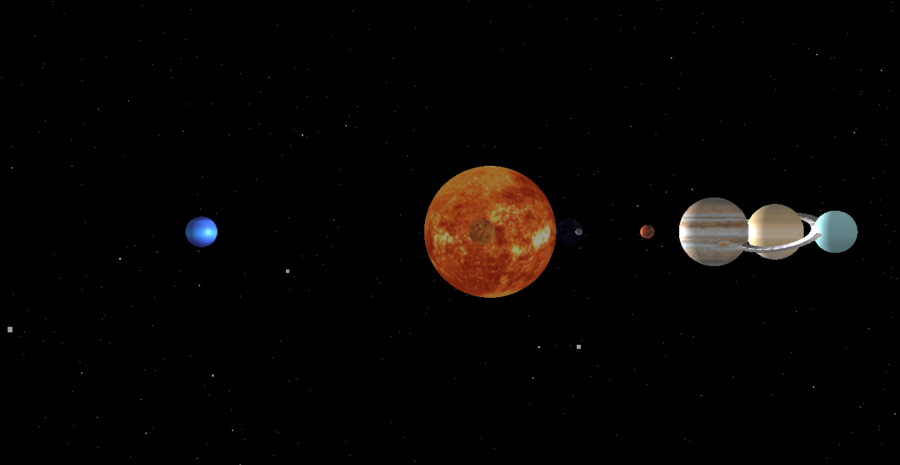

# 3D Solar System

This is a fun project to create a realistic 3D Solar System using Javascript.

## How to install and run 3D solar System on your machine

### Install NodeJS

[Download the latest version of NodeJS](https://nodejs.org/en/download) and install it on your machine.

### Download the source code

Make sure to have git installed on your machine. If you don't have it, you can follow the instructions [here](https://git-scm.com/book/en/v2/Getting-Started-Installing-Git). Once you installed git, you can simply download the source code with the following command:

```
git clone https://github.com/sasadangelo/3d-solar-system
cd 3d-solar-system
```

### Install all the required dependencies

Before to start, make sure to have all the dependencies installed in the 3d-solar-system folder. To do that, simply type the command:

```
npm install
```

a `node-modules` folder will be created in the `3d-solar-system` folder with all the required dependencies in it. 

### Run the HTTP Server

Type the following command to start the HTTP Server:

```
npx http-server
```

the command will display an URL that should be something similar to `http://127.0.0.1:8080`.

### Run the 3D Solar System in your browser

Open your browser and insert the above mentioned URL. You should see a black universe with some random stars, the Sun rotating in the center, all the planets rotating around the Sun. At the moment, the scene is visible only frontally. Here a screenshot of the browser.


